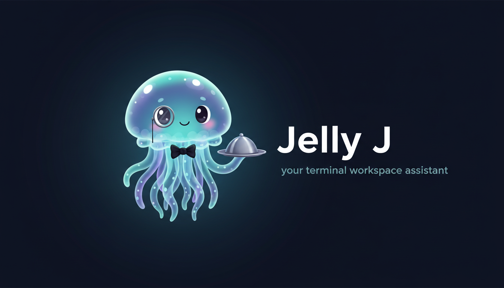

<p align="center">
  
</p>

> Your terminal workspace has a new roommate.
> Press `Alt+j` and tell it what you need.

Jelly J is a Claude-powered assistant that lives inside [Zellij](https://zellij.dev).
Instead of memorizing keybindings, you just talk to it — "create a tab for logs",
"split this into three panes running htop, kubectl, and lazygit",
"name all my unnamed tabs based on what's running in them".

It sees your entire workspace layout, understands what's running where,
and reorganizes things on your behalf. It even checks in every 5 minutes
to suggest improvements (like a tidy roommate, not an annoying one).

## Experimental status and fork dependency

Jelly J is currently experimental and depends on a custom Zellij fork.

- Required Zellij fork: `git@github.com:victorarias/zellij.git` (currently `main`)
- Reason: Jelly J relies on plugin-platform improvements that are not in current Zellij releases yet
- Build dependency: `plugin/Cargo.toml` uses a local path dependency to `zellij-tile` (`../../../zellij/zellij-tile`)
- Expected local checkout path for this repo layout: `~/projects/zellij`

Important:
- This setup is intentionally ahead of upstream; behavior may differ from stock Zellij.
- If you run Jelly J against upstream release binaries, some launcher/butler behavior can degrade or fail.

## What it can do

- **Name things** — tabs and panes, based on what's actually running
- **Rearrange** — move, resize, float, stack, fullscreen any pane
- **Create** — new tabs and panes running any command
- **Inspect** — dump the full layout, list tabs, show what's connected
- **Configure** — find, read, and edit your active Zellij config/layout files
- **Explain** — answer Zellij how/why questions from a bundled condensed docs reference
- **Tidy up** — the heartbeat checks for unnamed tabs, overcrowded layouts, idle panes
- **Escape hatch** — run any `zellij action` subcommand directly

## Quick start

### Prerequisites

- [Zellij fork](https://github.com/victorarias/zellij) (current experimental dependency for Jelly J)
- [Bun](https://bun.sh) (v1.3+)
- [Rust](https://www.rust-lang.org/tools/install) (for building the Zellij plugin)
- [Claude Code](https://docs.anthropic.com/en/docs/claude-code) CLI (authenticated — Jelly J uses the Agent SDK which requires a valid Claude Code session)

### Install & run

```bash
# Install globally
npm install -g jelly-j
jelly-j

# Or clone for development
git clone https://github.com/victorarias/jelly-j
cd jelly-j && npm install && bun src/index.ts
```

### Build and install plugin

```bash
cd plugin
cargo build --release --target wasm32-wasip1
cp target/wasm32-wasip1/release/jelly-j.wasm ~/.config/zellij/plugins/
```

### Zellij keybinding (required for Alt+j)

Add to your `~/.config/zellij/config.kdl`:

```kdl
keybinds {
    shared {
        bind "Alt j" {
            MessagePlugin "file:~/.config/zellij/plugins/jelly-j.wasm" {
                name "toggle"
                floating true
            }
        }
    }
}
```

`MessagePlugin` sends `toggle` to the persistent butler plugin, launching it if needed.

### Singleton semantics

- Jelly J enforces one global backend daemon per computer (`~/.jelly-j/agent.lock.json`).
- `jelly-j` in any Zellij session opens a local UI client that connects to that same daemon.
- Multiple sessions can have a Jelly J UI pane at the same time, sharing one conversation context.
- New UI clients replay recent global history from `~/.jelly-j/history.jsonl` on connect.
- `Ctrl-C` does not exit the UI client.
- `exit` / `quit` input is intentionally disabled (hide/show with `Alt+j` instead).
- If a UI pane closes, the daemon stays alive; pressing `Alt+j` opens a fresh connected UI.
- If restart gets stuck in a weird state, run `npm run ops:restart` (lock-aware, timeout-bounded).
- For isolated test runs, set `JELLY_J_STATE_DIR=/tmp/some-dir` to isolate Jelly J state without changing `HOME`.

### Fish shell helper (optional)

```fish
function jj --description "Toggle Jelly J via plugin pipe"
    zellij pipe --plugin file:$HOME/.config/zellij/plugins/jelly-j.wasm --name toggle -- toggle
end
```

## How it works

```
┌──────────────────────────────────────────┐
│  Zellij Session                          │
│                                          │
│  ┌─────────┐  ┌─────────┐  ┌─────────┐  │
│  │  Tab 1  │  │  Tab 2  │  │  Tab 3  │  │
│  │ ┌─────┐ │  │ ┌─────┐ │  │ ┌─────┐ │  │
│  │ │pane │ │  │ │pane │ │  │ │pane │ │  │
│  │ ├─────┤ │  │ └─────┘ │  │ └─────┘ │  │
│  │ │pane │ │  │         │  │         │  │
│  │ └─────┘ │  └─────────┘  └─────────┘  │
│  └─────────┘                             │
│                                          │
│  ┌─ ─ ─ ─ ─ ─ ─ ─ ─ ─ ─ ─ ─ ─ ─ ─ ─┐  │
│    Jelly J (floating pane)               │
│  │ ❯ name all my tabs                 │  │
│    [zellij] get_layout                   │
│  │ [zellij] rename_tab name="logs"    │  │
│    [zellij] rename_tab name="deploy"     │
│  │ Done! Named 3 tabs based on ...    │  │
│  └─ ─ ─ ─ ─ ─ ─ ─ ─ ─ ─ ─ ─ ─ ─ ─ ─┘  │
└──────────────────────────────────────────┘
         │                    ▲
         │  User prompt       │  Tool calls
         ▼                    │
   ┌───────────┐        ┌─────────┐
   │  Claude    │───────▶│  Zellij │
   │  Opus 4.6 │  MCP   │  CLI    │
   └───────────┘        └─────────┘
         │
    Heartbeat (every 5m)
         │
   ┌───────────┐
   │  Claude    │──▶ Popup suggestion
   │  Haiku 4.5│     (floating pane)
   └───────────┘
```

- **UI client**: session-local readline prompt in a floating Zellij pane
- **Daemon backend**: one global process handling chat execution, model/session state, and history replay
- **Agent runtime**: Claude Opus 4.6 via the [Agent SDK](https://docs.anthropic.com/en/docs/claude-code/agent-sdk)
- **Butler plugin**: persistent Zellij WASM plugin handling `Alt+j` toggle and pipe IPC
- **Tools**: Zellij MCP tools + Claude Code built-in agentic tools (Read/Edit/Write/Grep/Glob/Bash/Task)
- **Permission policy**: Bash always prompts; writes outside detected Zellij config roots always prompt
- **Heartbeat**: Haiku 4.5 checks butler state every 5 minutes, shows popup suggestions

## Tools

### Workspace state

| Tool | What it does |
|------|-------------|
| `get_layout` | Dump the full layout as KDL — tabs, panes, IDs, commands, positions |
| `list_tabs` | List all tab names in the session |
| `list_clients` | List connected clients, focused panes, running commands |
| `get_butler_state` | Get cached tabs/panes directly from the butler plugin |

### Tab management

| Tool | What it does |
|------|-------------|
| `go_to_tab` | Switch by index or name, optionally create if missing |
| `new_tab` | Create a tab with optional name, cwd, layout |
| `close_tab` | Close the focused tab |
| `rename_tab` | Rename focused tab, or rename by 0-based position through butler IPC |

### Pane management

| Tool | What it does |
|------|-------------|
| `new_pane` | Open tiled, floating, or stacked pane with optional command |
| `close_pane` | Close the focused pane |
| `rename_pane` | Rename focused pane, or rename by pane ID through butler IPC |
| `hide_pane_by_id` | Hide/suppress pane by ID through butler IPC |
| `show_pane_by_id` | Show/unsuppress pane by ID through butler IPC |
| `move_focus` | Move focus in a direction |
| `move_pane` | Move the focused pane |
| `resize_pane` | Resize the focused pane |
| `toggle_floating_panes` | Show/hide all floating panes |
| `toggle_pane_embed_or_floating` | Convert floating ↔ tiled |
| `toggle_pane_pinned` | Pin/unpin a floating pane |
| `toggle_fullscreen` | Toggle fullscreen |
| `change_floating_pane_coordinates` | Reposition/resize a floating pane by ID |
| `write_to_pane` | Send keystrokes to the focused pane |

### Escape hatch

| Tool | What it does |
|------|-------------|
| `zellij_action` | Run any `zellij action` subcommand directly |

### Config and docs

| Tool | What it does |
|------|-------------|
| `get_zellij_config_info` | Detect active config/layout/cache/plugin paths (`zellij setup --check`) |
| `list_zellij_config_files` | List files under active config roots |
| `read_zellij_config_file` | Read config/layout/theme/plugin files |
| `write_zellij_config_file` | Write full content to a config-related file |
| `edit_zellij_config_file` | Deterministic string-replace patching for config files |
| `get_zellij_knowledge` | Return bundled condensed Zellij reference |
| `search_zellij_knowledge` | Search bundled reference sections by topic |

The bundled reference source is tracked at `docs/zellij-knowledge-condensed.md`.
`get_zellij_knowledge` also prepends your local detected Zellij version so answers can be interpreted against installed behavior.

## Heartbeat

Every 5 minutes (after an initial 2-minute delay), Jelly J quietly checks your workspace using Haiku 4.5. If it spots something worth mentioning — like a bunch of unnamed tabs, an overcrowded layout, or idle panes — it pops up a short suggestion in a floating pane that auto-closes after 30 seconds.

It skips checks while you're actively chatting, so it won't interrupt you.

## Cost

Main interactions use Claude Opus 4.6 (priced per conversation turn).
Heartbeat uses Claude Haiku 4.5 (~$0.001/check × 12/hour × 8 hours ≈ **$0.10/day**).

## Development

```bash
git clone https://github.com/victorarias/jelly-j
cd jelly-j
npm install

# Run from source
npm start

# Type-check
npm run typecheck

# Build for distribution
npm run build

# Run the built version
bun dist/index.js

# Build the plugin
cd plugin
cargo build --release --target wasm32-wasip1
```

## License

[MIT](LICENSE)
